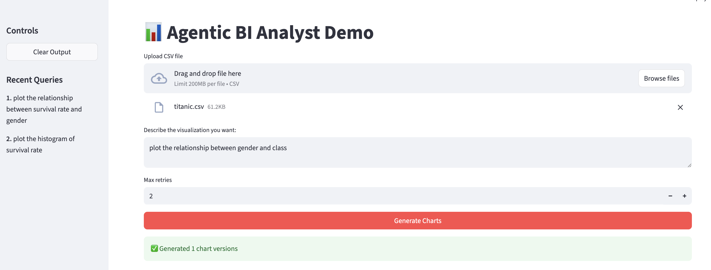
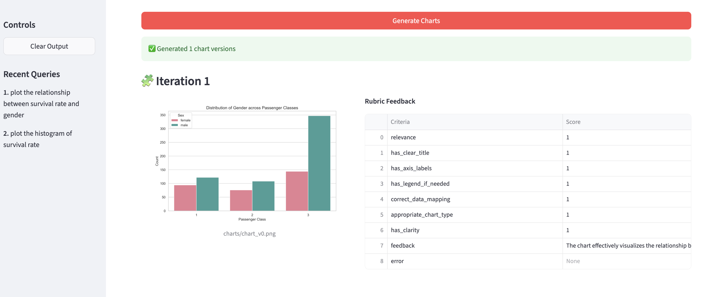
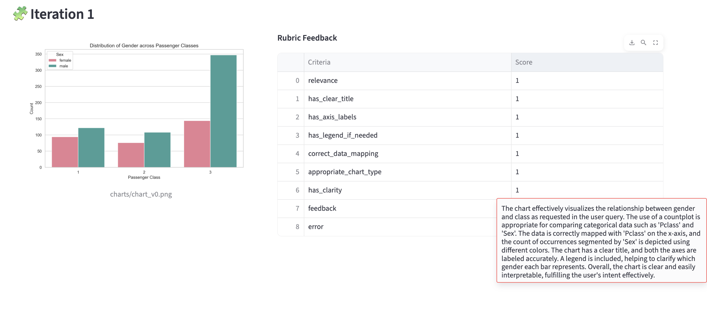
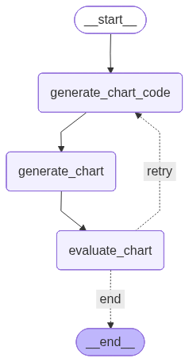

## Self-Evaluating Data Viz Agent
A reflective, feedback-driven analytics system that generates and evaluates data visualizations through an autonomous reasoning loop. Built on a reflective design pattern, the system continuously improves its output using external evaluators grounded in objective, multimodal feedback criteria.

## Key Features

✅ Reflective Agentic Loop – Self-improving code generation based on evaluator feedback<br>
✅ Objective Rubric Evaluation – Quantitative scoring for every chart iteration<br>
✅ Multimodal Evaluation – Evaluates both generated code and chart image<br>
✅ LangGraph State Management – Tracks state transitions across reflection cycles<br>
✅ Sequential Feedback History – Keeps full rubric log from all retries<br>
✅ FastAPI Backend + Streamlit UI – Lightweight, production-ready setup<br>
✅ Chart Caching & Cleanup – Serve generated charts dynamically and clear with one endpoint<br>

## Tech Stack

| Layer                      | Technology                            |
| :------------------------- | :------------------------------------ |
| **Backend Framework**      | FastAPI                               |
| **Frontend UI**            | Streamlit                             |
| **Workflow Orchestration** | LangGraph, LangChain & LangSmith      |
| **Evaluation Schema**      | Pydantic                              |
| **Visualization**          | Matplotlib, Seaborn                   |
| **Data Processing**        | Pandas                                |
| **Package & Env Manager**  | [uv](https://github.com/astral-sh/uv) |
| **Runtime**                | Python ≥ 3.10                         |

## 🎥 Demo

The **Agentic BI Analyst** combines LLM reasoning with visual analytics — turning natural language queries into polished visualizations and self-improving feedback loops.  
Below are some screenshots showcasing the workflow and UI in action.

### 🧠 1. Upload & Query
Users can upload a CSV dataset, type a natural language query (e.g., *“Show survival rate by passenger class”*), and choose the retry limit.



---

### 📊 2. Generated Charts
The **Analyst LLM Agent** generates valid Python code for plotting, executes it safely, and saves the charts.  
Each iteration refines the visualization based on evaluator feedback.



---

### 📈 3. Evaluator Feedback (Rubric)
The **Evaluator Agent** reviews the generated chart using objective, rubric-based criteria —  
assessing accuracy, clarity, chart type, data mapping, and more.



---

### 🔁 4. Iterative Refinement
If the chart does not meet quality standards, feedback is looped back to the generator,  
leading to successive improvements — demonstrating a **reflective design pattern**.



---

### 💡 5. Chart Browser & History
The Streamlit UI displays all generated charts and feedback summaries in one place.  
You can browse, compare, and analyze all iterations interactively.


## 🚀 Getting Started

Follow these steps to set up and run the application locally.

```bash
# 1️⃣ Clone the repository
git clone https://github.com/zufeshan12/agentic-bi-analyst.git
cd agentic-bi-analyst

# 2️⃣ Create and activate a virtual environment (optional but recommended)
uv venv
source .venv/bin/activate  # On Windows use: .venv\Scripts\activate

# 3️⃣ Install dependencies from pyproject.toml
uv sync

# 4️⃣ Set up environment variables
# Create a .env file in the project root and add the following:
# (Adjust according to your provider or environment)

OPENAI_API_KEY=your_openai_api_key
LANGSMITH_API_KEY=your_langsmith_api_key
LANGSMITH_ENDPOINT="https://api.smith.langchain.com"
LANGSMITH_PROJECT="BI Analyst"
LANGCHAIN_TRACING_V2=true

# 5️⃣ Start the FastAPI backend
uvicorn main:app --reload

# 6️⃣ In another terminal, run the Streamlit frontend
streamlit run app.py


------------------------------------------------------------


